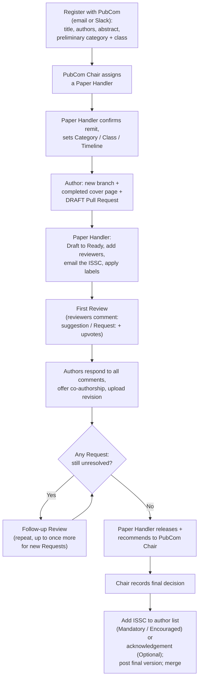

# ISSC Publication Portal

Repository for **ISSC publications in internal review**. This portal implements the
[LSST–ISSC Publication Review Manual, v1.0](https://github.com/LSSTISSC/PubCom-sandbox) (April 2, 2025).

> **The review is run inside a Pull Request (PR).** GitHub Issues are used only as an optional public
> record of the registration step. If the README and the Manual ever disagree, the Manual wins.

See the [open review PRs](https://github.com/LSSTISSC/PubCom-sandbox/pulls) for publications currently under review.

---

## The process at a glance

A fully worked example is in **[DEMO_WALKTHROUGH.md](DEMO_WALKTHROUGH.md)**.

---

## For authors

### 1 · Register (email or Slack)
Message PubCom with **title, author(s), abstract**, and your **preliminary category and class**.
If you want specific expert reviewers invited, name them now. The Chair assigns a **Paper Handler**,
who confirms the publication is in ISSC remit and sets the final **category, class and timeline**.
_(You may optionally open a [registration issue](../../issues/new?template=register-publication.md) for a public record — but it is not the review.)_

### 2 · Open the review Pull Request
Once the Paper Handler approves:
1. **Create a new branch** off `main`, named for your publication (`Branches → New branch`).
2. **Add your completed cover page** — copy [`Publications/summary_doc_template.md`](Publications/summary_doc_template.md), fill in every field (including the **enumerated section outline** under *Detailed description*), save it as `Publications/<your-title>.md`, and **commit**.
3. **Open a Draft Pull Request**:
   - Paste the cover-page text into the description (the paper/software PR template gives you the checklist to paste it under).
   - **Assignees** = all authors (add the Paper Handler once known).
   - **Do not** assign reviewers — the Paper Handler does that.

### 3 · Respond to feedback
Reply to each comment in its thread, quoting the reviewer and tagging their username.
Address **every** comment (a `Request:` may be answered with a justification rather than a change).
**Offer co-authorship** to any reviewer whose feedback significantly improved the publication.
When done, upload the revised version at the stated link and tell the Paper Handler.

---

## For reviewers (any ISSC member)

1. Open the review PR and read the cover page under **Files changed**.
2. Leave feedback either as a **line comment** under the relevant section (then **Start a review**) or under **Conversation**.
3. **Mark required feedback** by prefixing the comment with **`Request:`** — validity-critical. Everything else is a **suggestion** (improves quality but doesn't change core results).
4. **Upvote with 👍.** More-upvoted comments are treated as higher priority to resolve.
5. If you raised a `Request:`, you must engage with the authors' response, and you resolve your own comment once satisfied.

> *You are reviewing readiness for publication as an ISSC product — teams produce better work than individuals. But the premise of the publication has already been developed by the authors and does not itself merit criticism.*

---

## For the Paper Handler (PubCom)

Work the checklist that ships in the PR template. In short:

- **Open:** check procedural compliance, confirm/adjust category-class-timeline, apply labels, convert Draft → Ready, add requested reviewers, and email the ISSC (PR link + abstract + publication link).
- **Close First Review:** remind reviewers to re-review; the original commenter resolves their own comment; you adjudicate anything unresolved. An un-adopted `Request:` is either re-classified to a suggestion (with the authors' justification) or the change is required.
- **Follow-up:** repeat as needed — once more at most, for newly raised Requests you agree are needed — keeping the original timeline stream.
- **Conclude:** **release** and recommend to the **Chair**, who records the **final decision**. Confirm the final version carries the ISSC author-line (Mandatory/Encouraged) or acknowledgement (Optional), post it, set `status: concluded`, and merge.

Labels live in [`.github/labels.yml`](.github/labels.yml) (category · class · timeline · status) and can be auto-synced to the repo.

---

## Timeline streams

| Stream | First Review | Follow-up | Typical use |
|--------|--------------|-----------|-------------|
| **i · Accelerated** | 1 week | ≥ 3 days per stage | Conference proceedings, short notes |
| **ii · Standard** | 2 weeks | ≥ 1 week | Most peer-reviewed papers |
| **iii · Extended** | 3 weeks | ≥ 1 week | Dissertations, long works |

## Repository layout

| Path | Purpose |
|------|---------|
| `Publications/summary_doc_template.md` | The cover page authors copy and complete |
| `.github/PULL_REQUEST_TEMPLATE/` | Paper & software review PR templates (full lifecycle checklist) |
| `.github/ISSUE_TEMPLATE/register-publication.md` | Optional pre-PR registration record |
| `.github/labels.yml` | Category / class / timeline / status labels |
| `DEMO_WALKTHROUGH.md` | End-to-end worked example of one publication |
